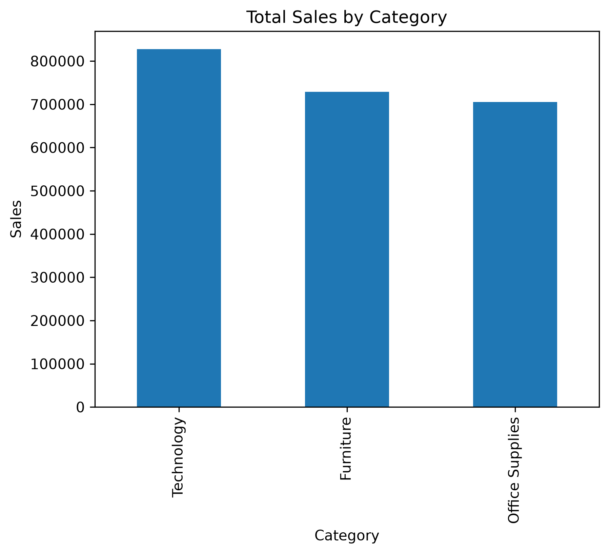
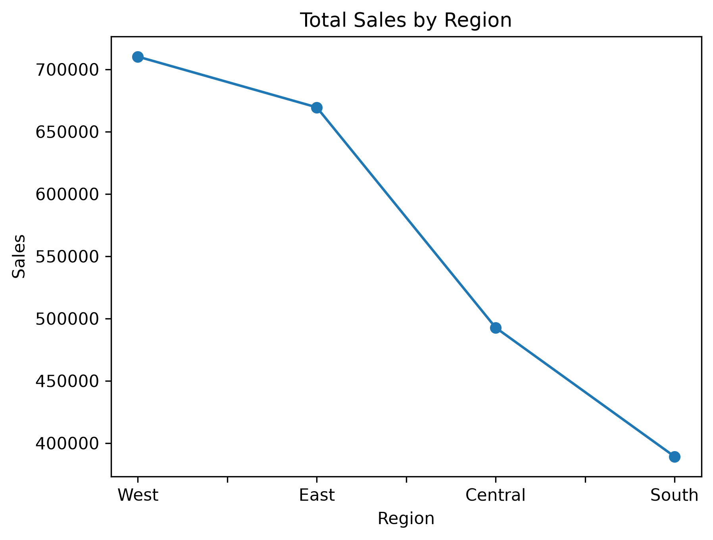

# Retail Sales Performance Analysis

## Executive Summary
This project delivers a robust Exploratory Data Analysis (EDA) data pipeline developed in Python to evaluate retail transactional performance. Processing a dataset of 9,800 records across 18 unique operational variables, the script automates data ingestion, standardizes date schemas, executes multi-dimensional aggregations, and generates high-resolution visualizations to isolate core organizational revenue drivers.

## Technical Environment & Libraries
* **Language:** Python
* **Data Manipulation:** Pandas
* **Data Visualization:** Matplotlib
* **Core Methodologies:** Feature Engineering, Vectorized Datetime Transformations, Multi-Axis Aggregations, and Trend Analysis.

## Data Engineering & Pipeline Phases
1. **Ingestion & Schema Diagnostics:** Loaded relational sales records and evaluated initial dataframe geometry `(9800, 18)` alongside structural data types via descriptive programming methods.
2. **Type Optimization:** Cast string-based temporal attributes (`Order Date` and `Ship Date`) into native `datetime64[ns]` objects to ensure accurate chronological sequencing and arithmetic validity.
3. **Feature Engineering:** Extracted granular temporal dimensions (`order_year`, `order_month`, and `order_month_name`) from validated datetime indices to support advanced seasonality profiling.
4. **Data Aggregation & Visual Profiling:** Conducted automated group-by operations to isolate performance drivers across structural, geographic, and temporal dimensions, exporting charts as production assets.

## Documented Business Insights

### 1. Product Category Performance
Aggregated gross revenues across primary business categories established Technology as the leading product segment in terms of overall revenue generation:
* **Technology:** $827,455.87
* **Furniture:** $728,658.58
* **Office Supplies:** $705,422.33



### 2. Geographic Distribution
Geographic segmentation identified the West region as the highest grossing territory across the domestic market landscape, indicating highly optimal market penetration.



### 3. Temporal & Seasonality Trends
Temporal analysis revealed clear cyclical demand variations within the annual business cycle:
* **Q4 Peak Performance:** Sales heavily concentrate in November ($350,161.71) and December ($321,480.17), indicating strong seasonal dependencies and holiday-driven demand.
* **Q1 Operational Trough:** February records the lowest quarterly operational volume ($59,371.12), highlighting a critical window for targeted marketing campaigns or inventory optimization.

### 4. Chronological Growth Trajectory
Year-over-Year (YoY) revenue calculations confirm sustained compounding organizational growth across the recorded historical timeline:
* **2015:** $479,856.21
* **2016:** $459,436.01
* **2017:** $600,192.55
* **2018:** $722,052.02

## Highlighted Script: Feature Transformation & Aggregation
The following code snippet demonstrates the feature engineering process used to extract datetime metrics and aggregate categorical performance natively within the data pipeline, saving outputs directly to disk.

```python
import pandas as pd
import matplotlib.pyplot as plt

# Standardize string data types to explicit datetime objects
df['Order Date'] = pd.to_datetime(df['Order Date'], dayfirst=True)
df['Ship Date'] = pd.to_datetime(df['Ship Date'], dayfirst=True)

# Feature engineering: extract chronological analysis vectors
df['order_year'] = df['Order Date'].dt.year
df['order_month'] = df['Order Date'].dt.month
df['order_month_name'] = df['Order Date'].dt.month_name()

# Execute multi-dimensional data aggregation for reporting
category_sales = df.groupby('Category')['Sales'].sum().sort_values(ascending=False)

# Export visualization asset for reporting
category_sales.plot(kind='bar', title='Total Sales by Category')
plt.ylabel('Sales')
plt.savefig('category_sales.png', bbox_inches='tight', dpi=300)
plt.close()
